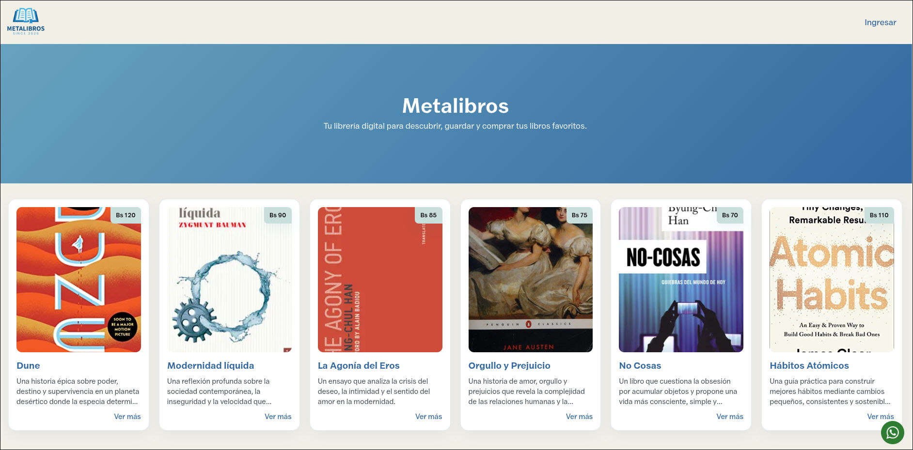

# Metalibros

Es una tienda online de venta de libros de pensamiento crítico y clásicos de la literatura.

> Todos los datos e interacciones están de cierta forma falseadas ya que no tiene interactividad con JS, esta página fue desarrollada puramente con HTML y CSS.

Página web desplegada: https://cr0wg4n.github.io/metalibros/

### Flujo de Navegación
Para entender un tanto la navegación dentro de la página se puede utilizar el siguiente flujo:

1. Se inicia en el landing page, `/index.html`, en el login se encuentra el item de navegación llamado "Ingresar", haz clic.
2. Serás redirigido a la página de Login, `/login.html`, en ella se ve un formulario de login estándar, llénalo y pulsa "Entrar".
3. Serás redirigido a la página inicial en el sistema de administración, la página `/dashboard.html`, esta contiene datos interesantes acerca del negocio y las ventas.
4. Haz clic en el segundo item del sidebar, el cual se llama "Libros Publicados", este te redirigirá a la página `/book-list.html`, la cual tiene un montón de libros. Puedes darle clic al botón que dice "Agregar nuevo libro" o darle clic al tercer item del sidebar llamado "Registro de Libros".
5. Cualquiera de las dos acciones anteriores te redirigirán a la página `/book-register.html`, en ella es posible agregar un nuevo libro, pulsa "Guardar Libro" para ser redirigido nuevamente.
6. Serás redirigido a la página `/book-admin.html`, encargada de listar de forma más ordenada los libros existentes del sistema.
7. Adicionalmente, como último item en el menú de configuration, podrás ver la opción de "Configurar Perfil", haz clic y serás redirigido a `/profile.html`, la página de configuración de tu perfil de usuario.

### Detalles Técnicos del Desarrollo de la Página Web

Las consideraciones iniciales con las que se desarrolló esta Página Web están ligadas a los criterios expuestos dentro de la "Evaluación práctica Semana 1", sin embargo, a continuación se muestra el desglose de los puntos tomados en cuenta para brindar una página web amigable con el usuario común y con el desarrollador.

1. Al tratarse de una página web con solo CSS y HTML, los estándares son muy importantes, es más fácil cometer errores cuando no se tiene ayuda de algún framework predefinido. Por lo que se usó `BEM` para el nombrado de las clases, ya que es ideal para el establecimiento de convenciones de nombrado de clases y etiquetas semánticas de HTML para mejorar el SEO y la accesibilidad de la página.

2. Elementos repetidos cuentan con un módulo CSS desacoplado para ser llamado en aquellas páginas que lo necesiten, como por ejemplo `sidebar.css` y `book-card.css`, dichos módulos son independientes de los módulos CSS que usan cada página.

3. Se introdujo un módulo CSS base llamado `base.css` con variables CSS que pueden llamarse y reutilizarse a lo largo de los archivos CSS existentes, esto permite parametrizar la UI y ser consistente, brindando una gran experiencia al usuario final.

4. El uso de colores no es aleatorio, se eligió una paleta de colores en relación a la temática del sitio web, en este caso, venta de libros. Se creó una marca, con logotipo y favicon.ico incluidos, igualmente se tuvieron algunas consideraciones adicionales como el espaciado, el estilo de las tarjetas o cards, inputs y casi todos los elementos visuales. Esta es la paleta de colores elegida:
    *  primary: #3368A0
    *  secondary: #66A3BF
    *  accent: #C8DFDB
    *  surface: #F2EFE7
    *  surface-alt: #F9FAFB
    *  white: #FFFFFF
    *  text: #363738
    *  muted: #475569
    *  success: #2F7D32
    *  dark: #1F2D3D

5. Finalmente, se consideró igualmente el uso de meta tags en cada página HTML para mejorar el SEO y la experiencia del usuario al compartir cada enlace (en el caso de que la Página Web realmente se despliegue).

